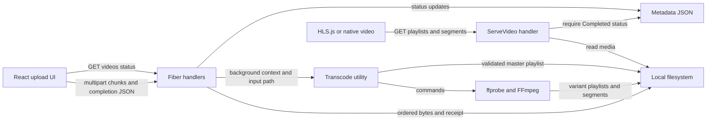
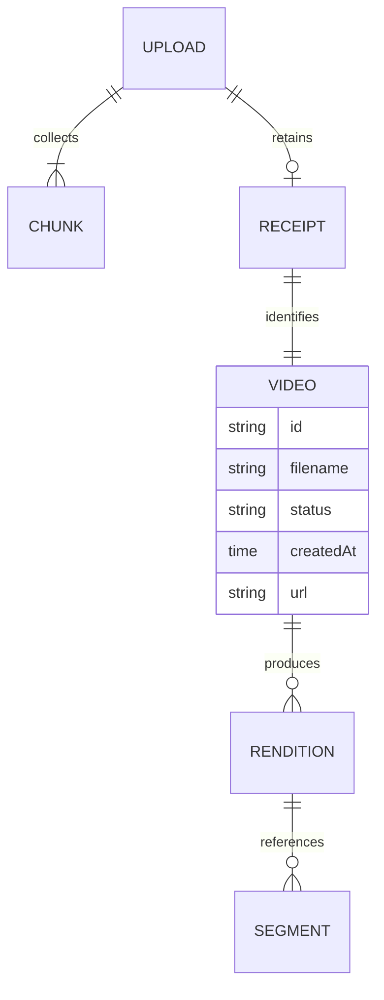
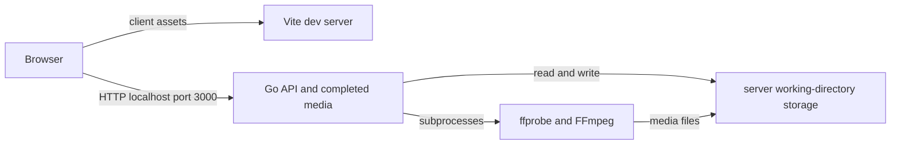

# Architecture

## Overview

The application separates a browser interface from a local API and media server. Within the Go process, handlers own upload lifecycle, utilities own transcoding and metadata, and the filesystem is the shared durable store. There is no separate worker service: the handler starts a goroutine after claiming a single processing slot ([worker](../../server/handlers/upload.go#L102)).

## Components

| Component | Responsibility | Lives in | Talks to |
| --- | --- | --- | --- |
| Browser shell | Holds the current video URL and connects upload to player. | [web/src/](../../web/src/), [map](03-structure.md#web-source) | Upload and player components |
| Upload client | Sequential chunk transfer, progress, completion and status polling. | [web/src/components/](../../web/src/components/), [map](03-structure.md#web-components) | HTTP API |
| Player | HLS.js attachment, browser fallback, quality selection. | [web/src/components/](../../web/src/components/), [map](03-structure.md#web-components) | Completed-media route |
| API bootstrap | Middleware, route registration, signals and directory setup. | [server/](../../server/), [map](03-structure.md#server-root) | Handlers and metadata recovery |
| Upload lifecycle | Validation, atomic chunk publication, assembly, receipt and worker admission. | [server/handlers/](../../server/handlers/), [map](03-structure.md#server-handlers) | Metadata and transcoder |
| Media and metadata utilities | Execute external binaries; validate HLS; serialize metadata writes. | [server/utils/](../../server/utils/), [map](03-structure.md#server-utilities) | Local disk and subprocesses |

## Boundaries and contracts

| Boundary | Contract and failure behavior | Evidence |
| --- | --- | --- |
| `POST /api/upload/chunk` | Multipart `uploadId`, canonical decimal `index` 0–199, `chunk` 1 byte–5 MiB. IDs match ASCII letters/digits/underscore/hyphen, length 1–64. Existing uncompleted indices can be replaced; receipt blocks further chunks with 409. | [upload.go:36](../../server/handlers/upload.go#L36) |
| `POST /api/upload/complete` | JSON `uploadId`, basename-only nonempty `filename` up to 255 bytes, `total` 1–200. Requires exactly that many valid numbered chunks. 201 returns `videoID`, `filename`, relative `url`, `message`; a saved receipt replays the same response. Busy or shutdown returns 503. | [upload.go:73](../../server/handlers/upload.go#L73) |
| `GET /api/videos` | JSON array of metadata; read/parse errors become 500 `metadata unavailable`. It is neither paginated nor filtered. | [upload.go:29](../../server/handlers/upload.go#L29) |
| Health and legacy upload | Health always returns `{"status":"ok"}`; it does not probe disk or binaries. Legacy upload returns 410. | [upload.go:28](../../server/handlers/upload.go#L28), [upload.go:180](../../server/handlers/upload.go#L180) |
| `GET /videos/*` | Matches only master/variant playlists and numbered segments for an ID marked Completed. Other paths or unfinished videos return 404; metadata read failure returns 500. There is no route authentication. | [upload.go:182](../../server/handlers/upload.go#L182) |
| Media subprocesses | Input protocol whitelist `file,pipe`; container whitelist `mov,matroska,webm,avi,mpegts`; first video and optionally first audio mapped into three renditions. Context cancels subprocess execution. | [video.go:24](../../server/utils/video.go#L24) |

## Data model

The diagram models filesystem relationships, not database tables. Upload IDs and generated video UUIDs are different identifiers ([completion](../../server/handlers/upload.go#L87)).

| Entity | Stored in | Key fields or names | Defined at |
| --- | --- | --- | --- |
| Upload/chunk | `temp_chunks/<uploadId>/<index>` | Client upload ID; numbered binary chunks | [upload.go:42](../../server/handlers/upload.go#L42) |
| Receipt | `temp_chunks/<uploadId>/receipt.json` | `videoID`, `filename`, `url`, `message` | [upload.go:149](../../server/handlers/upload.go#L149) |
| Video metadata | `videos/metadata.json` array | `id`, `filename`, `status`, `createdAt`, `url` | [metadata.go:11](../../server/utils/metadata.go#L11) |
| Input and HLS output | `videos/<videoID>/` | Temporary `input`, `master.m3u8`, `v0`–`v2` playlists and `.ts` segments | [upload.go:124](../../server/handlers/upload.go#L124), [video.go:40](../../server/utils/video.go#L40) |

## State and persistence

Metadata transitions from Processing to Completed or Failed; startup changes interrupted Processing records to Failed ([worker](../../server/handlers/upload.go#L145), [recovery](../../server/utils/metadata.go#L88)). Every update rereads and rewrites the JSON array under a process mutex, syncing a temporary file, renaming it and syncing the parent directory ([metadata.go:34](../../server/utils/metadata.go#L34)). Invalid JSON is returned as an error and is not replaced.

Chunk publication uses rename, but receipts use a direct write and assembly/chunks/receipts/metadata do not share a transaction ([upload.go:58](../../server/handlers/upload.go#L58), [upload.go:145](../../server/handlers/upload.go#L145)). The in-memory processing slot, cancellation context and wait group disappear on restart. Assembled input is removed after the worker returns; receipts, abandoned chunks, finished outputs and partial failed outputs have no automatic retention cleanup ([upload.go:159](../../server/handlers/upload.go#L159), [README](../../README.md#L25)).

## Deployment

The checked-in run targets start separate server and Vite processes ([Makefile:21](../../Makefile#L21)). A build creates `server/bin/server` and Vite output; Go does not register a route for the built React app ([Makefile:16](../../Makefile#L16), [main.go:38](../../server/main.go#L38)). Browser API URLs are fixed to `http://localhost:3000`, so a remote deployment requires code/configuration work ([FileUpload.tsx:65](../../web/src/components/FileUpload.tsx#L65)).

## Failure and scale

- **Admission:** A process-wide mutex serializes chunk writes and completion assembly; a one-slot channel rejects overlapping transcodes instead of queueing them; the browser retries 503 completion responses within its three-minute admission window ([upload.go:20](../../server/handlers/upload.go#L20), [upload.go:102](../../server/handlers/upload.go#L102), [FileUpload.tsx:104](../../web/src/components/FileUpload.tsx#L104)).
- **Processing:** The worker has a two-minute context. A transcode error becomes Failed; failure to persist that terminal state is only logged, so metadata may remain Processing until restart recovery ([upload.go:162](../../server/handlers/upload.go#L162)).
- **Startup:** Corrupt metadata stops startup through `log.Fatal`; missing metadata is treated as an empty list ([main.go:21](../../server/main.go#L21), [metadata.go:22](../../server/utils/metadata.go#L22)).
- **Capacity:** Metadata reads and updates scale with the full file; every media request also reads the full array to check readiness ([upload.go:190](../../server/handlers/upload.go#L190)); filesystem locks are process-local. Multiple server processes sharing storage are not coordinated. V1 explicitly limits itself to a local single-process demo ([metadata.go:34](../../server/utils/metadata.go#L34), [README](../../README.md#L25)).
