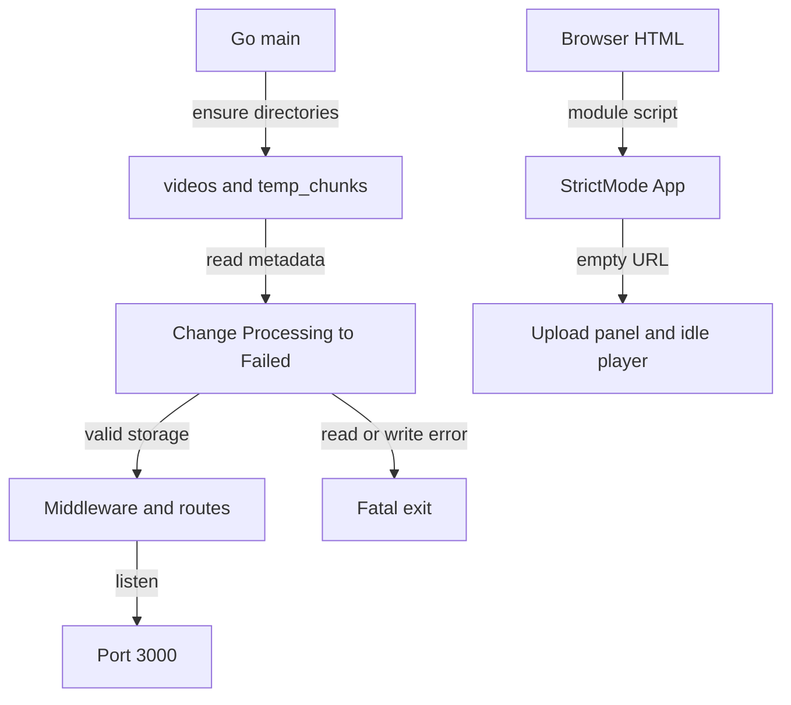
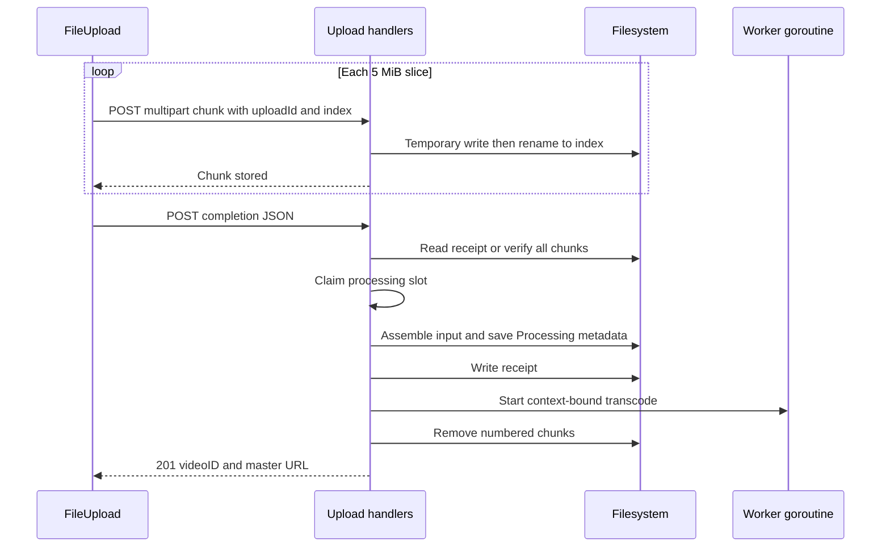
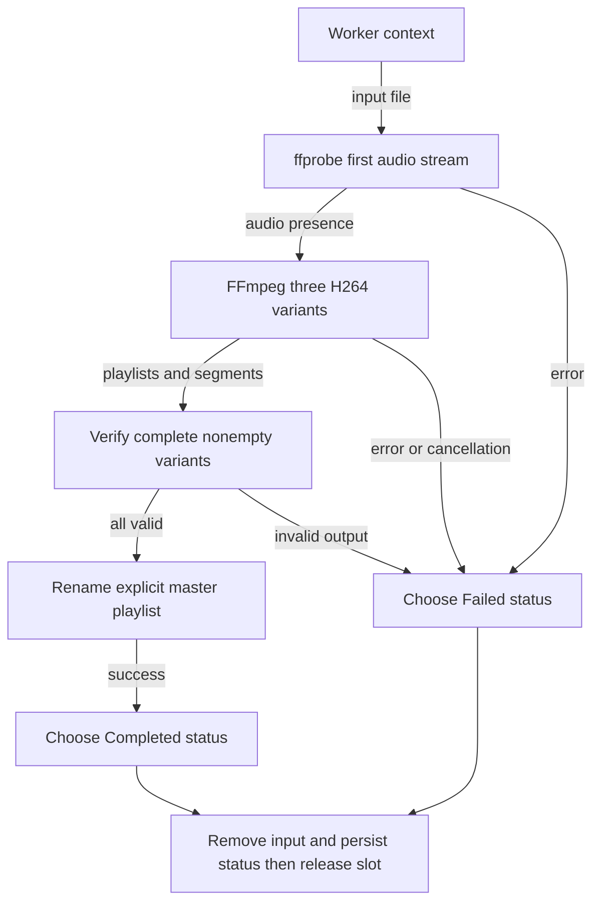
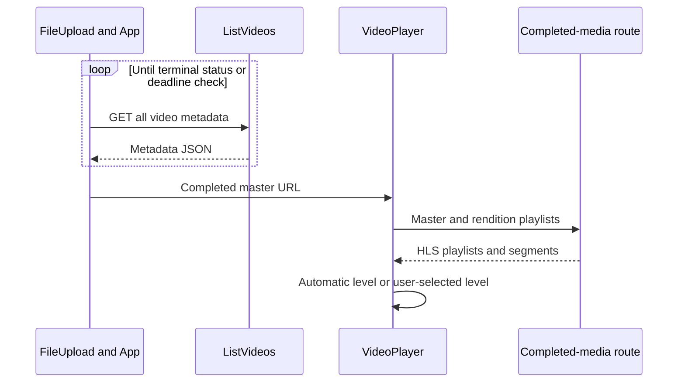
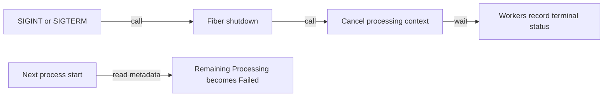
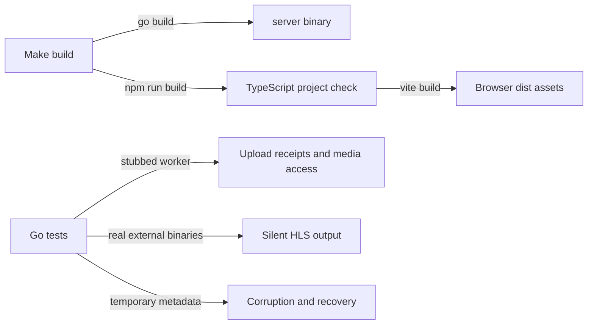

# Flow

## Startup

1. **Prepare storage:** Create `./videos` and `./temp_chunks` if absent. Paths depend on the process working directory. [main.go:17](../../server/main.go#L17) · [structure](03-structure.md#server-root).
2. **Recover state:** Read metadata, replace Processing statuses with Failed and persist each change. Any error aborts startup. [metadata.go:88](../../server/utils/metadata.go#L88), [main.go:21](../../server/main.go#L21) · [structure](03-structure.md#server-utilities).
3. **Expose HTTP:** Configure a 6 MiB request body limit, logging, panic recovery and wildcard CORS; register completed-media and API routes; listen on port 3000. The `100MB` inline comment is stale. [main.go:25](../../server/main.go#L25) · [structure](03-structure.md#server-root).
4. **Mount the browser:** HTML loads the module entry point; React StrictMode mounts App. App initially has no video URL and connects FileUpload's success callback to VideoPlayer. [index.html:10](../../web/index.html#L10), [main.tsx:6](../../web/src/main.tsx#L6), [App.tsx:6](../../web/src/App.tsx#L6) · [structure](03-structure.md#web-source).

## Upload and completion

1. **Choose input:** Drag/drop checks the browser MIME prefix; the file picker uses `accept="video/*"`. The shared handler rejects zero or greater-than-1000-MiB input and ignores a second upload while one is active. [FileUpload.tsx:31](../../web/src/components/FileUpload.tsx#L31), [FileUpload.tsx:141](../../web/src/components/FileUpload.tsx#L141) · [structure](03-structure.md#web-components).
2. **Transfer sequentially:** Create a UUID, slice into 5 MiB chunks, post multipart `chunk`, `uploadId`, `index`, and compute progress from each request. Each chunk request has a 60-second timeout; an AbortController is shared across upload, completion and polling. [FileUpload.tsx:42](../../web/src/components/FileUpload.tsx#L42) · [structure](03-structure.md#web-components).
3. **Publish a chunk:** Hold the upload mutex; reject shutdown, unsafe ID, noncanonical/out-of-range index and invalid chunk size. Check for a receipt, save to a temporary file, then rename to the numbered path. [upload.go:36](../../server/handlers/upload.go#L36) · [structure](03-structure.md#server-handlers).
4. **Request completion:** After all chunk requests finish, send the upload ID, original filename and total count. Retry 503 responses at roughly two-second intervals within a three-minute admission window; each request is capped at 30 seconds or the remaining time. Other errors end the attempt. [FileUpload.tsx:76](../../web/src/components/FileUpload.tsx#L76), [FileUpload.tsx:104](../../web/src/components/FileUpload.tsx#L104) · [structure](03-structure.md#web-components).
5. **Validate or replay:** Under the same mutex, validate JSON fields. If a receipt exists, replay it with 201. Otherwise require numbered, regular, nonempty, bounded chunks and an exact directory entry count; invalid input returns 400. [upload.go:73](../../server/handlers/upload.go#L73) · [structure](03-structure.md#server-handlers).
6. **Admit and assemble:** Nonblocking channel acquisition returns 503 when busy. Generate a separate video UUID, create an exclusive `input` file, then stream chunks in numeric order using `io.Copy`. Before successful handoff, deferred cleanup removes the new video directory and releases admission. [upload.go:102](../../server/handlers/upload.go#L102) · [structure](03-structure.md#server-handlers).
7. **Record and launch:** Persist Processing metadata, write the replay receipt, start a tracked worker, remove chunks, return 201. Receipt write failure attempts to save Failed and returns 500; these writes are not one atomic transaction. [upload.go:145](../../server/handlers/upload.go#L145) · [structure](03-structure.md#server-handlers).

## Background transcoding

1. **Bound work:** Derive a two-minute deadline from the shared shutdown context. [upload.go:159](../../server/handlers/upload.go#L159) · [structure](03-structure.md#server-handlers).
2. **Probe and encode:** Create `v0`–`v2`; use ffprobe to detect first audio stream. Map the first video three times, optionally map audio three times, encode 640×360/854×480/1280×720 H.264 at 800/1400/2800 kbps with optional 128 kbps AAC. Emit VOD HLS with a requested two-second segment duration. [video.go:18](../../server/utils/video.go#L18) · [structure](03-structure.md#server-utilities).
3. **Validate and publish:** Require `#EXT-X-ENDLIST`, at least one referenced segment, basename-only `.ts` paths and nonzero segment sizes for each rendition. Write and rename an explicit master with declared bandwidths 1.2/2/4 Mbps. Validation checks files, not decoded media integrity. [video.go:44](../../server/utils/video.go#L44) · [structure](03-structure.md#server-utilities).
4. **Finish lifecycle:** Set Completed or Failed, remove input, save terminal metadata, and release the processing slot and wait group. Terminal persistence errors are logged; the response to the original completion request has already been sent. [upload.go:164](../../server/handlers/upload.go#L164) · [structure](03-structure.md#server-handlers).

## Polling and playback

1. **Observe state:** Poll `/api/videos`, locate the returned video ID, return on Completed or throw on Failed. Wait up to two seconds between iterations within a separate three-minute polling window. Each request is capped at 15 seconds or the remaining time; a network error or timeout ends the attempt. [FileUpload.tsx:117](../../web/src/components/FileUpload.tsx#L117), [upload.go:29](../../server/handlers/upload.go#L29) · [structure](03-structure.md#web-components).
2. **Hand off the URL:** On completion, prefix the relative URL with the fixed server origin and invoke the App callback. App updates the player's `src`. [FileUpload.tsx:89](../../web/src/components/FileUpload.tsx#L89), [App.tsx:27](../../web/src/App.tsx#L27) · [structure](03-structure.md#web-source).
3. **Attach playback:** If supported, instantiate HLS.js, attach the video element and discover quality labels from manifest heights. Attempt autoplay, silently accepting browser autoplay rejection. Otherwise use native HLS when available. [VideoPlayer.tsx:18](../../web/src/components/VideoPlayer.tsx#L18) · [structure](03-structure.md#web-components).
4. **Serve and switch:** The media handler validates the path, requires Completed metadata, sets the playlist/segment content type and sends the file. Auto sets `currentLevel=-1`; manual selection finds a level by height. Native fallback has no HLS.js quality-level selection. [upload.go:182](../../server/handlers/upload.go#L182), [VideoPlayer.tsx:99](../../web/src/components/VideoPlayer.tsx#L99) · [structure](03-structure.md#web-components).
5. **Handle errors and teardown:** Fatal HLS network errors restart loading, media errors request recovery, other fatal errors destroy the instance. Effects destroy HLS on source change/unmount; upload cleanup aborts its active requests. [VideoPlayer.tsx:57](../../web/src/components/VideoPlayer.tsx#L57), [FileUpload.tsx:13](../../web/src/components/FileUpload.tsx#L13) · [structure](03-structure.md#web-components).

## Shutdown and recovery

1. **Stop HTTP then workers:** The signal goroutine calls `app.Shutdown()` before `StopProcessing()`. When `Listen` returns, main also calls `StopProcessing`; it cancels the shared context under the upload lock and waits for workers. Shutdown does not delete abandoned upload directories. [main.go:50](../../server/main.go#L50), [upload.go:27](../../server/handlers/upload.go#L27) · [structure](03-structure.md#server-root).
2. **Recover interrupted records:** On the next startup, Processing records become Failed rather than resuming input or replaying work. [metadata.go:88](../../server/utils/metadata.go#L88) · [structure](03-structure.md#server-utilities).

## Build and verification

1. **Build artifacts:** Make runs Go build from `server/` and the web package's build script, which checks TypeScript projects before Vite bundling. It does not package FFmpeg or host browser assets through Go. [Makefile:16](../../Makefile#L16), [package.json:8](../../web/package.json#L8) · [structure](03-structure.md#root).
2. **Verify server behavior:** Handler tests use temporary working directories and a replaceable transcode function to test unsafe/missing inputs, exact assembly and receipt idempotency. An additional handler test checks Completed-only media access and rejection of input/metadata URLs. Utilities test real short silent-video output plus metadata corruption/recovery. [upload_test.go:19](../../server/handlers/upload_test.go#L19), [video_test.go:13](../../server/utils/video_test.go#L13) · [structure](03-structure.md#server-handlers).
3. **Verify client statically:** Package scripts expose build and lint, with no browser/component test command. Prior success is recorded in history, not re-established by this documentation pass. [package.json:6](../../web/package.json#L6), [HISTORY.md:60](../../HISTORY.md#L60) · [structure](03-structure.md#web-tooling).
